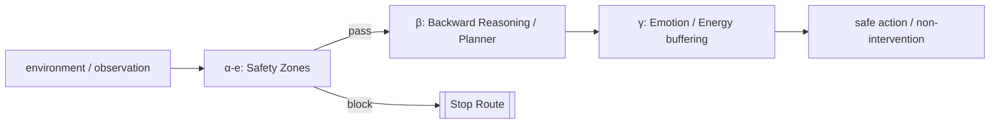

◇EarthLight-α-e   
# EarthLight-α-e: Safety Zones   
   
**Version:** 0.1   
**Author:** Kokko-Niwa   
**Formalization:** GPT-5 Thinking (diagrams, state table, pseudocode) — see repository Provenance note   
**Summary:** A minimal-intervention supervisory layer that halts action in graded stages based on the *magnitude, direction, and acceleration* of disparity. It sits in front of α-a's core equilibrium math and does not modify it.   
   
---   
   
## 0. What this module is (and is not)   
   
Safety Zones is a **supervisory gate**, not a scoring engine. It runs *before* α-a's evaluation and β's backward-reasoning planner. Its only job is to decide **pass / wait / stop** by watching how far the situation has drifted from the intended course, and how fast that drift is growing.   
   
- It does **not** rank options or compute virtue/priority — that is α-a's job.   
- It **does** exercise a hard veto: if drift is large or accelerating past a barrier, nothing downstream is allowed to run.   
- The α-a formulas (`Priority`, `Virtue`, `calc.py`) are **unchanged** by this module. Safety Zones is non-invasive.   
   
This is the implementation-side counterpart of the Foundation's **stopping organ** (Foundation 追記13-4: the high-speed *stop* that is the reverse face of the 90-degree cut). Where the 90-degree cut rejects options whose direction opposes the goal, Safety Zones rejects *continuation* when accumulated drift crosses a graded threshold. Both are the same veto machinery — one on candidate direction, one on trajectory drift.   
   
---   
   
## 1. Inputs   
   
- `f(t)` — **disparity**: how far the current state has drifted from the intended course.   
- `df/dt` — rate of drift (is it growing?).   
- `d²f/dt²` — acceleration of drift (is the growth itself speeding up?).   
- (optional) `energy_sum`, `target_clarity`, `Df` — hooks for γ (emotional/energy buffering) and for damage-fraction weighting.   
   
The design principle: **direction and acceleration matter as much as magnitude.** A small but sharply accelerating drift is treated as more dangerous than a large but flat one.   
   
---   
   
## 2. Layers (flowchart)   
   
```mermaid   
flowchart TD   
    A[Input: disparity f(t)] --> B{f < θ1 ?}   
    B -- Yes --> G[🟢 GREEN: normal operation / leave alone]   
    B -- No --> C{f < θ2 ?}   
    C -- Yes --> Y[🟡 CAUTION: alert & prepare]   
    C -- No --> D{f < θ3 ?}   
    D -- Yes --> O[🟠 WARNING: run action-1 + prepare hard stop]   
    D -- No --> R{f < θMAX ?}   
    R -- Yes --> RED[🔴 EMERGENCY: hard stop / rollback]   
    R -- No --> S[🚫 SAFETY BARRIER: absolute block]   
```   
   
---   
   
## 3. Threshold / gradient intuition   
   
```text   
disparity f   
 ^                                      θMAX (Barrier)   
 |                         θ3 (Red)  ──┤▇▇▇▇   
 |                    θ2 (Orange)  ──┤▇▇   
 |           θ1 (Yellow)          ──┤▇   
 |__ __ __ __ __ __ __ __ __ __ __ _└─────────────────> time t   
         ↑ if df/dt > 0 and d²f/dt² > 0, bias toward the danger side   
```   
   
---   
   
## 4. State table (stop with the fewest moves)   
   
| Zone    | Condition                     | Action                         | Note                         |   
| ------- | ----------------------------- | ------------------------------ | ---------------------------- |   
| GREEN   | `f < θ1`                      | leave alone                    | do not over-intervene        |   
| YELLOW  | `θ1 ≤ f < θ2` and `d²f/dt² ≤ 0` | prepare action-1, watch closely | if drift is gentle, one can wait |   
| ORANGE  | `θ2 ≤ f < θ3` or `d²f/dt² > 0` | run action-1 + prepare hard stop | act early once the gradient rises |   
| RED     | `θ3 ≤ f < θMAX`               | hard stop (block / rollback)   | early cutoff minimizes recovery cost |   
| BARRIER | `f ≥ θMAX`                    | absolute block (no passage)    | pre-empts ethical / structural breakage |   
   
---   
   
## 5. Pseudocode (directly implementable)   
   
```python   
def decide_action(f, df_dt, d2f_dt2, theta1, theta2, theta3, thetaMAX):   
    if f < theta1:   
        return "GREEN: noop"   
    if f < theta2 and d2f_dt2 <= 0:   
        return "YELLOW: prep_action1 + watch"   
    if f < theta3 or d2f_dt2 > 0:   
        return "ORANGE: do_action1 + prep_hard_stop"   
    if f < thetaMAX:   
        return "RED: hard_stop_now"   
    return "BARRIER: absolute_block"   
```   
   
If integrated into code later: place this in a new `src/guard.py` as `decide_action(...)`, leave `calc.py` untouched, and gate it behind an optional flag (e.g. `--guard on`) for time-series experiments. Not required for the spec to stand.   
   
---   
   
## 6. Connection to α / β / γ (current module assignment)   
   

   
- **α-e (Safety Zones)**: rejects first. Only a passing case is handed to β. Runs in front of α-a; α-a's math is unchanged.   
- **β (Backward Reasoning, non-public)**: goal-decomposition planner. If it detects drift mid-plan, it returns control to α-e for re-judgement.   
- **γ (Emotion)**: buffers human energy / emotional pressure (avoids the burst / collapse failure modes; see γ energy formulas).   
   
Note on module letters: in the current EarthLight assignment, **β = Backward Reasoning (non-public), γ = Emotion, δ = Freedom and Choice, ε = Creativity.** Older drafts used a different mapping; this file follows the current one.   
   
---   
   
## 7. Operating rules (the practical core)   
   
- **Minimal intervention**: never touch GREEN. Intervening tends to destabilize what was stable.   
- **Early cutoff**: once the gradient rises, act at ORANGE; at RED, stop without hesitation.   
- **Cost view**: anything **unrecoverable or very high recovery cost** is stopped pre-emptively at α-e (never passed to β).   
- **Calibration**: `θ1..θ3, θMAX` start small per domain and are re-tuned against measurements.   
   
This mirrors θ (problem-resolution): the goal is not to find the single correct answer but to avoid destruction, and the safe zone is wide. Safety Zones is that stance made into a runnable gate.   
   
---   
   
## References   
   
- Foundation 追記13-4 (stopping organ: the reverse face of the 90-degree cut)   
- EarthLight-θ (avoid-destruction stance / wide safe zone)   
- EarthLight-α-a (Core Equilibrium — unchanged by this layer)   
